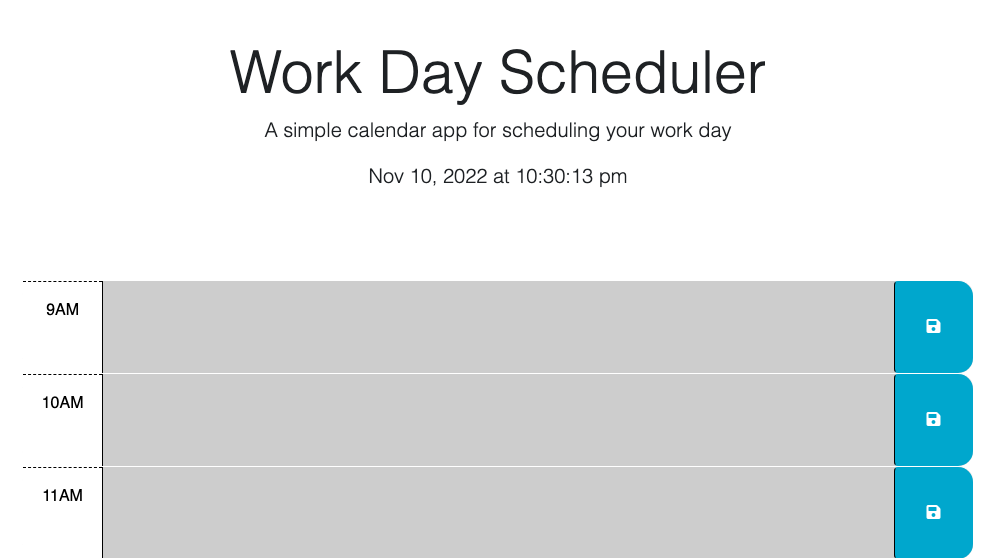

# Wrok-Day-Scheduler

## Description

This app was designed for the user who wants to plan their workday schedule, which allows efficient and timely distribution of information to the user. Users can save their workday schedule in the application, and the application will remind the user by changing different colors (grey: past, red: present, green: future) on the column every hour.

## Installation

N/A

## Usage

You can start to input and save your schedule in the column and then press the save button at the right. Once you saved all your schedules, you can leave this application open as a clock or as a reference of your schedule. 

Workday Scheduler link: https://weithefang.github.io/work-day-scheduler/

## Credits

N/A

## License

Please refer to the LICENSE in the repo
